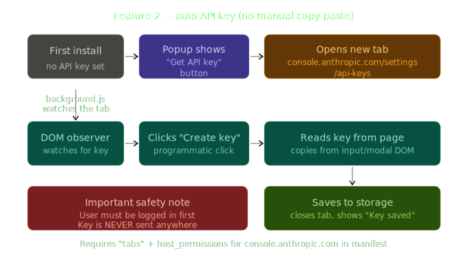
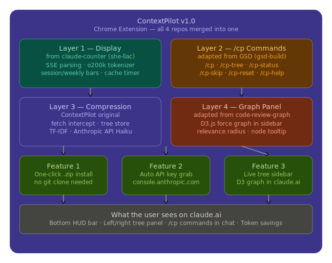

# ContextPilot v1.0.0

**One extension to rule your Claude token limits**

ContextPilot is a Chrome Extension for claude.ai that solves the token limit wall by compressing your chat history locally, giving you infinite conversation memory without burning through your hourly limits.

---

## The Problem

Every message you send to Claude makes it re-read the *entire* conversation from scratch. In a 20-message conversation, message #21 pays the token cost of all 20 previous messages plus itself. The longer you chat, the faster you burn through your limit. Hit the cap → wait 5 hours. Start a new chat → lose all context.

## The Solution

ContextPilot intercepts every outgoing request to Claude's API and replaces the full chat history with a **compressed context tree**. It uses Anthropic's API locally to compress exchanges into ~70 token nodes, storing them in IndexedDB. When you chat, it injects only the most relevant nodes.

```
Every message WITHOUT ContextPilot:
[Msg 1][Msg 2][Msg 3][Msg 4][Msg 5][Msg 6] + New prompt = ~5,000 tokens 🔴

Every message WITH ContextPilot:
[P3 summary 68tk][P6 summary 72tk] + New prompt = ~200 tokens ✅

Savings: 96%
```

---

## Features

1. **Automatic Compression:** Silently compresses history after every response.
2. **Smart Relevance (TF-IDF):** Injects only the most relevant context nodes for the current prompt.
3. **Live Token HUD:** Displays accurate session/weekly usage and cache timers right in claude.ai.
4. **Slash Commands:** Integrated `/cp` command system directly inside the Claude chat box.
5. **D3 Graph Panel:** A live, interactive visualization of your conversation tree.
6. **One-click .zip Install:** No git clone or build steps required.
7. **Auto API Key Capture:** Seamlessly grabs your Anthropic API key directly from the console.

---

## Installation

Install in 3 steps (no terminal needed):

1. Download `context-pilot-v1.0.0.zip` from the GitHub Releases.
2. Go to `chrome://extensions` in Chrome and enable **Developer mode** (toggle in the top right).
3. **Drag and drop** the downloaded zip file onto the extensions page.

Done! The extension is now active on claude.ai.

---

## API Key Setup



ContextPilot uses the Anthropic API (`claude-haiku-3-5`) to generate high-quality compressed summaries (costing roughly $0.001 per call).

**Auto Method:**
1. Click the ContextPilot icon in your Chrome toolbar.
2. Click **"Get API key automatically"**.
3. A tab will briefly open `console.anthropic.com` and automatically securely extract a new key.

**Manual Method:**
1. Go to [console.anthropic.com](https://console.anthropic.com).
2. Generate a new API key (`sk-ant-...`).
3. Click the ContextPilot popup and paste your key into the settings.

---

## Command Reference



Type any of these commands directly into the Claude chat box. They are intercepted locally and never sent to Claude.

| Command | What it does |
|---|---|
| `/cp` | Opens the status popup programmatically. |
| `/cp-tree` | Toggles the D3 graph sidebar panel. |
| `/cp-status` | Prints live token stats as a chat message. |
| `/cp-skip` | Skips compression for the next message only. |
| `/cp-pause` | Pauses ALL compression until resumed. |
| `/cp-resume` | Resumes compression. |
| `/cp-reset` | Clears the context tree for the current conversation. |
| `/cp-export` | Downloads the current conversation tree as a JSON file. |
| `/cp-mode deep` | Sets context injection depth to 3 nodes. |
| `/cp-mode light` | Sets context injection depth to 1 node. |
| `/cp-help` | Prints all commands as a system message in chat. |

---

## Architecture



ContextPilot is built upon 4 architectural layers, combining 4 open-source approaches into one extension:

| Layer | Source | What it does |
|---|---|---|
| **Display** | claude-counter (she-llac) | Live HUD for tokens, session/weekly bars, cache timer. |
| **Commands** | get-shit-done pattern | Local `/cp` slash commands intercepted from chat input. |
| **Compression** | ContextPilot original | Fetch intercept, lean payload injection, background compression. |
| **Graph panel** | code-review-graph (tirth8205)| D3.js sidebar visualizing the live prompt tree. |

---

## Privacy

- All data is stored completely locally in your browser's IndexedDB.
- The ONLY external call made is to `api.anthropic.com` for the compression logic.
- Your Anthropic API key is stored securely in `chrome.storage.local` and never leaves your machine.
- No analytics, telemetry, or tracking servers of any kind.

---

## Credits

This project stands on the shoulders of incredible open-source work:
- Display layer and tokenizer adapted from [claude-counter](https://github.com/she-llac/claude-counter) by she-llac.
- Slash command design pattern adapted from [get-shit-done](https://github.com/gsd-build/get-shit-done) by gsd-build.
- Graph visualization sidebar adapted from [code-review-graph](https://github.com/tirth8205/code-review-graph) by tirth8205.

## License

MIT
